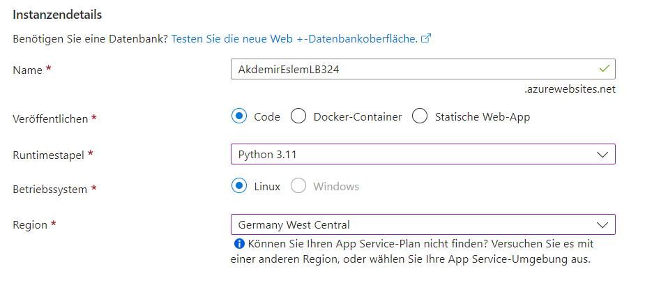

# LB 324

## Aufgabe 2

1. Dependencies installieren

```bash
pip install -r requirements.txt
```

2. Pre-commit mit Einstellungen installieren

```bash
pre-commit install --hook-type pre-commit --hook-type pre-push
```

## Aufgabe 4
Erklären Sie hier, wie Sie das Passwort aus Ihrer lokalen `.env` auf Azure übertragen.

1. Bei https://portal.azure.com/#home einloggen
   
2. Eine neue Web-App erstellen
   
3. Bei "Ressourcengruppe" ein neues Element erstellen
   
4. Diese Einstellungen bei den Instanzendetails auswählen:
   
   
5. Wenn man fertig ist unten "Weiter: Bereitstellung >" auswählen

6. Aktivieren auswählen
   
7. Mit dem GitHub Konto autorisieren

8. Dein Repository und das Main Branch auswählen
   
9. Alles überschpringen bis man "Erstellen" auswählen kann
    
10. Zurück zu https://portal.azure.com/#home gehen und die neu erstellte App auswählen
    
11. Bei den Einstellungen auf "Konfiguration" gehen
    
12. Eine neue Anwendungeinstellung erstellen
    
13. Beim Namen "PASSWORD" und beim Wert den Passwort, den du beim .env File eingegeben hast schreiben
    
14. Danach okay clicken und nicht vergessen zu speichern
    
15. https://akdemireslemlb324.azurewebsites.net/